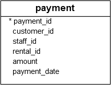

An aggregate function computes a single result from multiple input rows. For example, there are aggregates to compute the count, `sum`, `avg` (`average`), `max` (`maximum`) and `min` (`minimum`) over a set of rows.

```SQL
SELECT max(temp_lo) FROM weather;
```

```
 max
-----
  46
(1 row)
```

If we wanted to know what city (or cities) that reading occurred in, we might try:

```SQL
SELECT city FROM weather WHERE temp_lo = max(temp_lo);     -- WRONG
```

but this will not work since the aggregate `max` cannot be used in the `WHERE` clause. (This restriction exists because the `WHERE` clause determines which rows will be included in the aggregate calculation; so obviously it has to be evaluated before aggregate functions are computed.)

```SQL
SELECT city FROM weather
    WHERE temp_lo = (SELECT max(temp_lo) FROM weather);
```

```
     city
---------------
 San Francisco
(1 row)
```

Aggregates are also very useful in combination with `GROUP BY` clauses. For example, we can get the number of readings and the maximum low temperature observed in each city with:

```SQL
SELECT city, count(*), max(temp_lo)
FROM weather
GROUP BY city;
```

```
     city      | count | max
---------------+-------+-----
 Hayward       |     1 |  37
 San Francisco |     2 |  46
(2 rows)
```

which gives us one output row per city. Each aggregate result is computed over the table rows matching that city. We can filter these grouped rows using `HAVING`:

```SQL
SELECT city, count(*), max(temp_lo)
FROM weather
GROUP BY city
HAVING max(temp_lo) < 40;
```

```
  city   | count | max
---------+-------+-----
 Hayward |     1 |  37
(1 row)
```

## Postgresql COUNT Function
The `COUNT()` function is an `aggregate function` that allows you to get the number of rows that match a specific condition of a query.

## COUNT(*)

The `COUNT(*)` function returns the number of rows returned by a  `SELECT` statement, including NULL and duplicates.

```SQL
SELECT COUNT(*)
FROM table_name
WHERE condition;
```

When you apply the `COUNT(*)` function to the entire table, PostgreSQL has to scan the whole table sequentially.

## COUNT(column)

Similar to the `COUNT(*)` function, the `COUNT(column)` function returns the number of rows returned by a `SELECT` clause. However, it does not consider `NULL` values in the `column`.

```SQL
SELECT COUNT(column)
FROM table_name
WHERE condition;
```

## COUNT(DISTINCT column)

In this form, the `COUNT(DISTINCT column)` returns the number of unique non-null values in the `column`.

```SQL
SELECT 
   COUNT(DISTINCT column) 
FROM 
   table_name
WHERE
   condition;
```

We often use the `COUNT()` function with the `GROUP BY` clause to return the number of items for each group. For example, we can use the `COUNT()` with the `GROUP BY` clause to return the number of films in each film category.

## PostgreSQL COUNT() function examples

Let’s use the `payment` table in the sample database for the demonstration.



1) PostgreSQL `COUNT(*)`example

The following statement uses the `COUNT(*)` function to return the number of transactions in the `payment` table:

```SQL
SELECT COUNT(*)
FROM payment
```

2) PostgreSQL `COUNT(DISTINCT column)` example

To get the distinct amounts which customers paid, you use the `COUNT(DISTINCT amount)` function as shown in the following example:

```SQL
SELECT COUNT(DISTINCT amount)
FROM payment;
```

## PostgreSQL COUNT() with GROUP BY clause

To get the number of payments by the customer, you use the  `GROUP BY` clause to group the payments into groups based on customer id, and use the `COUNT()` function to count the payments for each group.

```SQL
SELECT customer_id, COUNT(customer_id)
FROM payment
GROUP BY customer_id;
```

## PostgreSQL COUNT() with HAVING clause

You can use the `COUNT` function in a  `HAVING` clause to apply a specific condition to groups. For example, the following statement finds customers who have made more than 40 payments:

```SQL
SELECT customer_id,
       COUNT(customer_id)
FROM payment
GROUP BY customer_id
HAVING COUNT(customer_id) > 40;
```