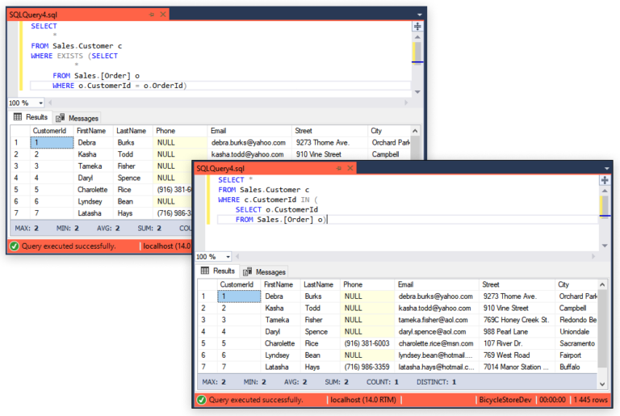

## SQL EXISTS or NOT EXISTS

`SQL EXISTS` is a logical operator that is used to check for the existence of rows in a database. It returns `TRUE` in case the subquery returns one or more records. `SQL` NOT `EXISTS` acts quite opposite to the `EXISTS` operator and is satisfied in case no rows are returned by the subquery.

## Using SQL EXISTS

The result of the `EXISTS` condition is a boolean value—`True` or `False`. SQL Server `EXISTS` can be used in `SELECT`, `UPDATE`, `INSERT`, or `DELETE` statements.

## SQL EXISTS syntax

```SQL
SELECT
      column_name
FROM Table_Name
WHERE EXISTS (SELECT
                    column_name
              FROM Table_Name
              WHERE condition);
```

```SQL
SELECT
      *
FROM Sales.Customer c
WHERE EXISTS (SELECT
                    *
              FROM Sales.[Order] o
              WHERE o.CustomerId = o.OrderId)
```

## Difference between IN and EXISTS SQL Server

Logical operator IN in SQL returns TRUE if a specified value matches one of the values in a subquery or a list. Simply put, the IN operator compares a given value to a specified list of values. In case the given value matches at least one value from the list, it returns TRUE, otherwise, FALSE is thrown.

Suppose, we continue our remarketing campaign and need to get a list of customers living in New York to send them a special offer.

```SQL
SELECT
     c.FirstName
    ,c.LastName
    ,c.Email
    ,c.City
FROM Sales.Customer c
WHERE City IN ('New York');
```



## Then which one to choose?


It is obvious that subqueries with IN are more intuitive, however, they’re slower and less efficient than the same queries written with EXISTS when it comes to large datasets.

We should also mention other major differences between the two operators:

* The output of the subquery with EXISTS can be either TRUE or FALSE, whereas the output of IN can be TRUE, FALSE, or NULL.
* The database engine stops checking rows for the EXISTS once it finds at least one matching row, for the IN, however, it scans every row for the specified value.
* Null values returned by subquery that is compared to the outer statement using IN or NOT IN return UNKNOWN. Thus, using null values with IN can lead to unexpected results.