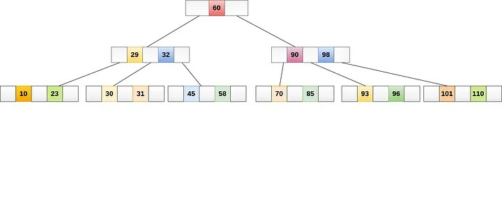

* По `PRIMARY KEY` и `UNIQUE` столбцам индекс создается автоматически.

Этапы индексирования:
* Определение столбца или столбцов в таблице базы данных, которые нужно индексировать. Обычно они определяются по тому, какие столбцы чаще всего используются в запросах или поисках.
*  Выбор алгоритма индексирования, подходящего для типа индексируемых данных. Например, индексы в виде B-деревьев обычно используются для индексирования строковых или числовых данных, а полнотекстовые индексы — для индексирования текстовых данных.
* Применение алгоритма индексирования к выбранным столбцам, что создаёт структуру данных, сопоставляющую значения в столбцах с местоположениями соответствующих записей таблицы.
* Сохранение индекса в отдельной структуре данных, обычно в другой части диска или в памяти, чтобы доступ к ней был более эффективным, чем к соответствующим табличным данным.
* Обновление индекса в случае добавления новых записей, удаления или изменения записей в таблице.

## Алгоритмы индексирования

* B-дерево
* Bitmap-индекс
* Хэш-индекс
* GiST (Generalized Search Tree, обобщённое поисковое дерево)
* Полнотекстовый индекс

## B-дерево

## Определение

B-дерево — это структура данных самобалансирующегося дерева, которая часто используется в качестве алгоритма индексирования в базах данных. Каждый узел дерева состоит из набора ключей и указателей на дочерние узлы; хранение данных осуществляется в иерархической структуре. Деревья B-узлов упорядочены таким образом, что позволяют быстро выполнять поиск, вставку и удаление данных.

## Класстеризованный индекс

Кластеризованный индекс хранит реальные строки данных в листьях индекса.

Важной характеристикой кластеризованного индекса является то, что все значения отсортированы в определенном порядке либо возрастания, либо убывания. 

Таким образом, таблица или представление может иметь только один кластеризованный индекс. В дополнение следует отметить, что данные в таблице хранятся в отсортированном виде только в случае если создан кластеризованный индекс у этой таблицы.
Таблица не имеющая кластеризованного индекса называется кучей.

## Некластеризованный индекс

В отличие от кластеризованного индекса, листья некластеризованного индекса содержат только те столбцы (ключевые), по которым определен данный индекс, а также содержит указатель на строки с реальными данными в таблице.

. Некластеризованные индексы не могут быть отсортированы в отличие от кластеризованных, однако вы можете создать более одного некластеризованного индекса на таблице или представлении, вплоть до 999

## Составной индекс

Такой индекс может содержать более одного столбца. Вы можете включить до 16 столбцов в индекс, но их общая длина ограничена 900 байтами. Как кластеризованный, так и некластеризованный индексы могут быть составными

## Уникальный индекс

Такой индекс обеспечивает уникальность каждого значения в индексируемом столбце. Если индекс составной, то уникальность распространяется на все столбцы индекса, но не на каждый отдельный столбец. К примеру, если вы создадите уникальных индекс на столбцах ИМЯ и ФАМИЛИЯ, то полное имя должно быть уникально, но отдельно возможны дубли в имени или фамилии.
Уникальный индекс автоматически создается когда вы определяете ограничения столбца: первичный ключ или ограничение на уникальность значений:

* Первичный ключ
Когда вы определяете ограничение первичного ключа на один или несколько столбцов, тогда SQL Server автоматически создаёт уникальный кластеризованный индекс, если кластеризованный индекс не был создан ранее (в этом случае создается уникальный некластеризованный индекс по первичному ключу)
* Уникальность значений
Когда вы определяете ограничение на уникальность значений, тогда SQL Server автоматически создает уникальный некластеризованный индекс. Вы можете указать, чтобы был создан уникальный кластеризованный индекс, если кластеризованного индекса до сих пор не было создано на таблице

## Покрывающий индекс

Такой индекс позволяет конкретному запросу сразу получить все необходимые данные с листьев индекса без дополнительных обращений к записям самой таблицы.