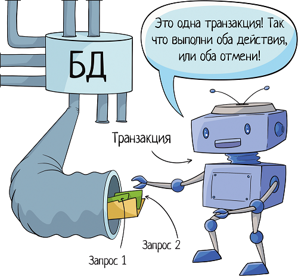

Требования ACID — набор требований, которые обеспечивают сохранность ваших данных. Что особенно важно для финансовых операций. Мы же не хотим остаться без денег из-за разрыва соединения или ошибки в ПО, не так ли?

`Atomicity — Атомарность`
`Consistency — Согласованность`
`Isolation — Изолированность`
`Durability — Надёжность`

## Atomicity - Атомарность

Атомарность гарантирует, что каждая транзакция будет выполнена полностью или не будет выполнена совсем. Не допускаются промежуточные состояния.

Транзакция же позволяет сгруппировать запросы.

И если падает запрос внутри транзакции, база откатывает всю транзакцию. И приходит в состояние «как было до начала транзакции». Даже если там внутри было 10 запросов, вы можете спать спокойно — сломался один, откатятся все.

## Consistency(Согласованность)
Когда говорят о согласованности в ACID, подразумевается, что транзакция приводит базу данных из одного допустимого состояния в другое, не нарушая никаких целостных ограничений. Если транзакция завершается успешно, то база данных остается в согласованном состоянии. Если происходит ошибка во время транзакции, база данных должна быть возвращена в предыдущее согласованное состояние.

Это обеспечивает, что даже в случае сбоя или ошибок транзакция не нарушит целостность данных в базе. Согласованность в ACID является важным аспектом для поддержания надежности и целостности данных в транзакционных системах баз данных.

## Isolation — Изолированность

Обеспечивает отделение выполнения одной транзакции от выполнения других транзакций. Изолированность предотвращает взаимное влияние транзакций, выполняемых параллельно, и обеспечивает, что каждая транзакция воспринимается как отдельная и независимая.

## (Durability) Надежность
Гарантирует, что после успешного завершения транзакции ее изменения останутся в базе данных навсегда, даже в случае сбоя системы или перезапуска.

